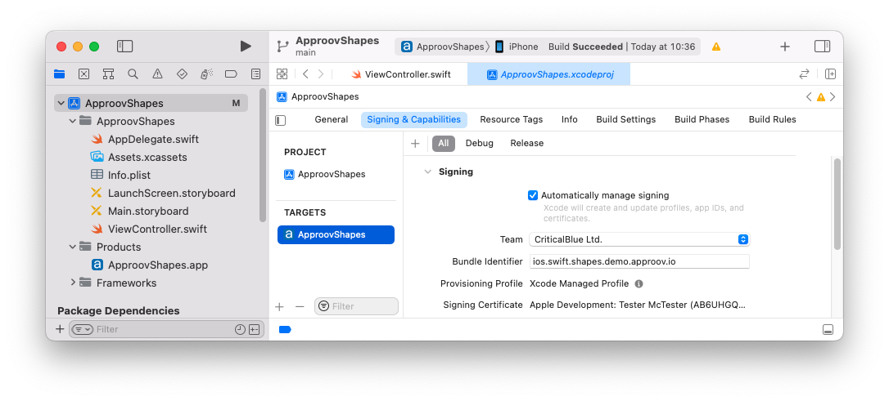
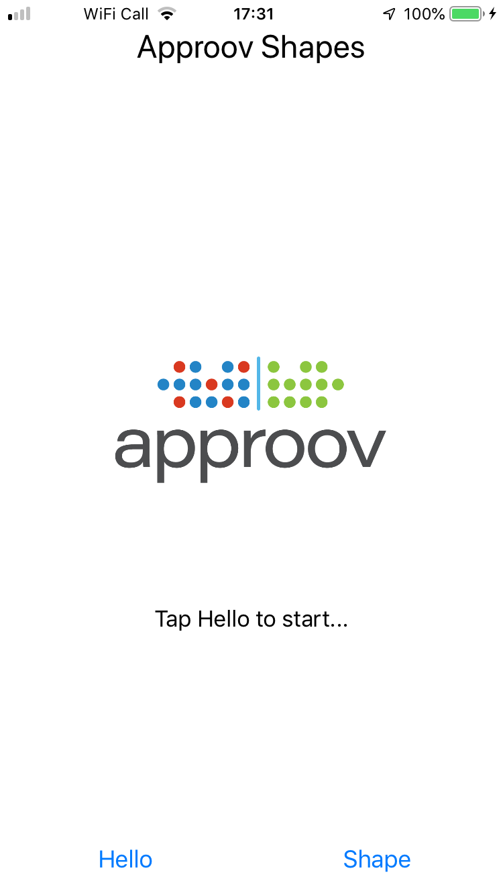
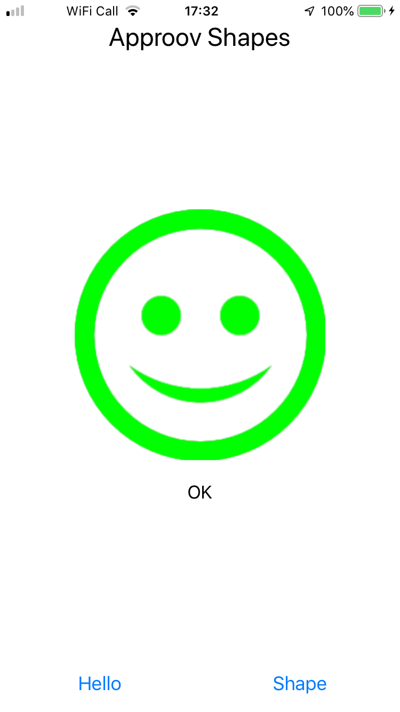
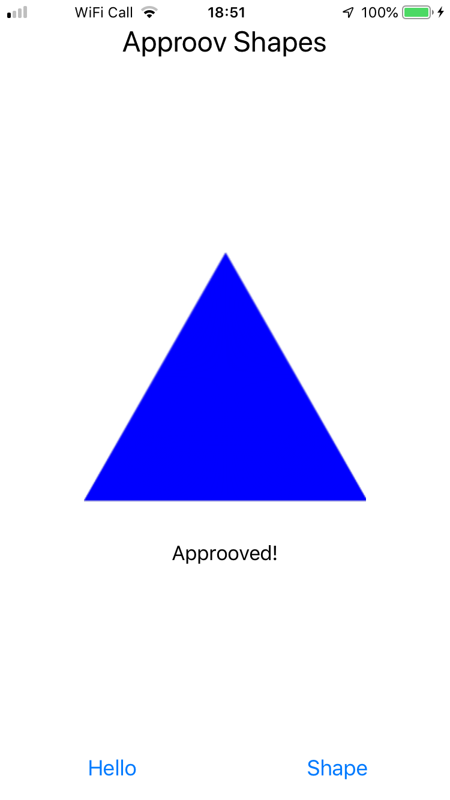
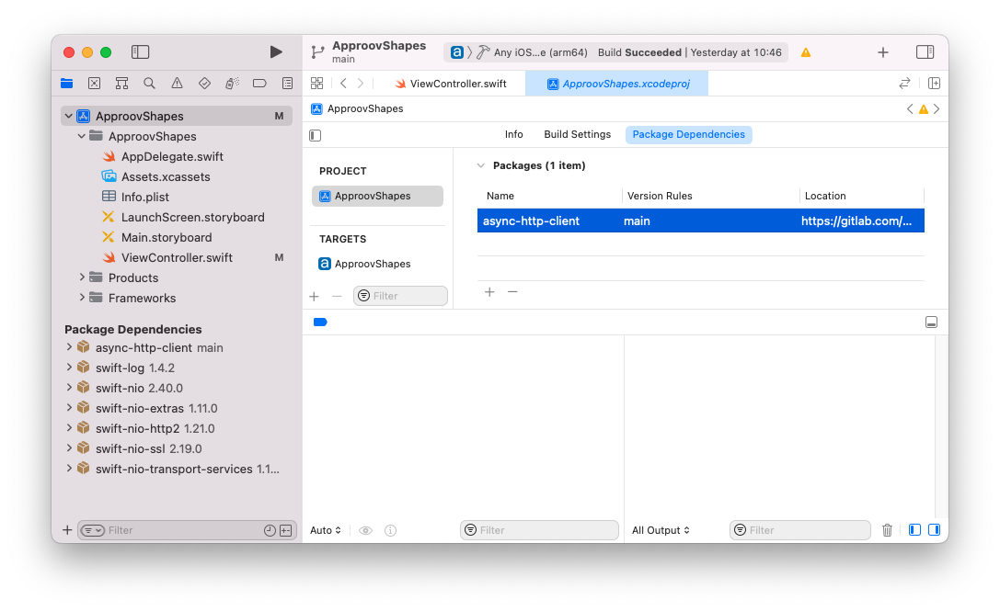
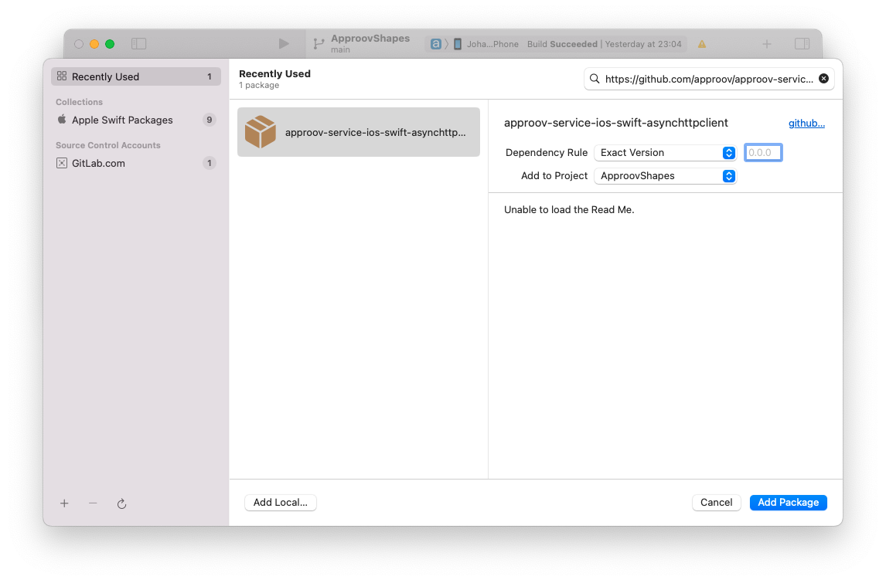
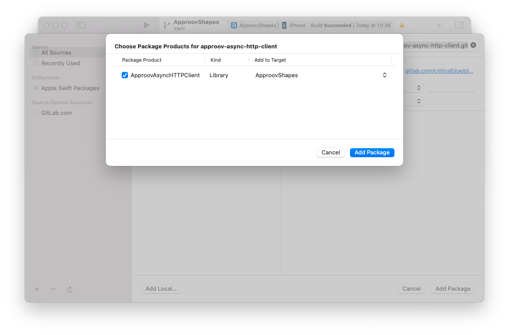
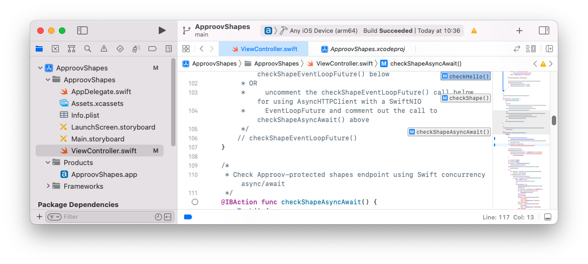
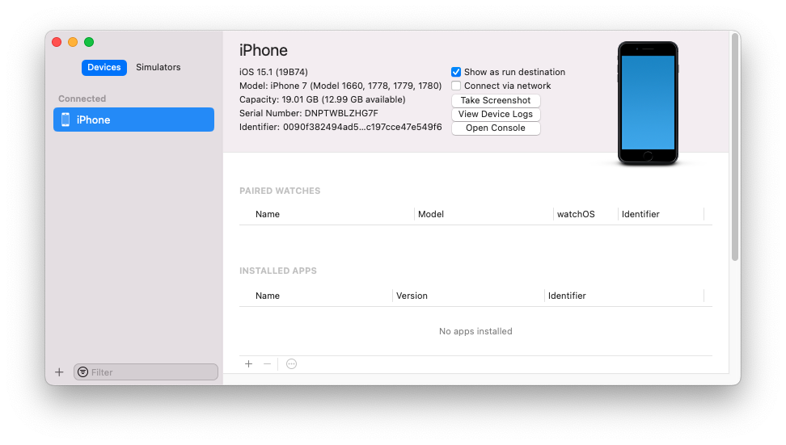

# Shapes Example

This quickstart is written specifically for native iOS apps that you wish to protect with Approov and that are written in Swift, making API calls using [`AsyncHTTPClient`](https://github.com/swift-server/async-http-client), a HTTP Client library built on top of SwiftNIO. This quickstart provides a step-by-step example of integrating Approov into an app using a simple `Shapes` example that shows a geometric shape based on a request to an API backend that can be protected with Approov.

## WHAT YOU WILL NEED
* Access to a trial or paid Approov account
* The `approov` command line tool [installed](https://approov.io/docs/latest/approov-installation/) with access to your account
* [Xcode](https://developer.apple.com/xcode/) version 13 installed (version 13.3 is used in this guide)
* The contents of this repo
* An Apple mobile device with iOS 13 or higher

## RUNNING THE SHAPES APP WITHOUT APPROOV

Open the `ApproovShapes.xcodeproj` project in the `shapes-app` folder using `File->Open` in Xcode. Ensure the `ApproovShapes` project is selected at the top of Xcode's project explorer panel.

Select your codesigning certificate in the `Signing & Capabilities` tab and run the application on your prefered device.



Once the application is running you will see two buttons:

<p>
    
</p>

Click on the `Hello` button and you should see this:

<p>
    
</p>

This checks the connectivity by connecting to the endpoint `https://shapes.approov.io/v1/hello`. Now press the `Shape` button and you will see this (or another shape):

<p>
    
</p>

This contacts `https://shapes.approov.io/v1/shapes` to get the name of a random shape. This endpoint is protected with an API key that is built into the code, and therefore can be easily extracted from the app.

The subsequent steps of this guide show you how to provide better protection, either by using an Approov token or by migrating the API key to become an Approov managed secret.

## ADD THE APPROOV ASYNC HTTP CLIENT DEPENDENCY

First you need to remove the existing dependency on `AsyncHTTPClient` from the project because the `ApproovAsyncHTTPClient` package already contains a dependency to a copy (fork) of the original `AsyncHTTPClient` package that has been modified to allow setting a custom TLS pinning verifier. Select the `ApproovShapes` project in Xcode and then in `Package Dependencies` select `async-http-client`, click the &mdash; symbol below and confirm removal.



Get the latest Approov integration by using the `Swift Package Manager`. The repository located at `https://github.com/approov/approov-service-ios-swift-asynchttpclient.git` includes further dependencies to a fork of `AsyncHTTPClient` that has been modified to enable setting a custom TLS pinning checker and the closed source Approov SDK and includes tags pointing to the relevant Approov SDK release versions. The `ApproovAsyncHTTPClient` package is actually an open source wrapper layer that allows you to easily use Approov with AsyncHTTPClient. Install the dependency by selecting the `ApproovShapes` project in Xcode and then selecting `File`, `Add Packages` and in the search box enter the url of the git repository `https://github.com/approov/approov-service-ios-swift-asynchttpclient.git`:



You will then have to select the relevant `ApproovAsyncHTTPClient` package version you wish to use; each version is identified by a tag, with the main branch usually pointing to the latest version. Select the `Exact Version` option and enter the package version, in this case `3.0.0`: Once you click `Add Package` the last screen will confirm the package product and target selection:



Click `Add Package` again, the `ApproovAsyncHTTPClient` package is now included as a dependency in your project.

## ENSURE THE SHAPES API IS ADDED

In order for Approov tokens to be generated for `https://shapes.approov.io/v1/shapes` it is necessary to inform Approov about it:
```
$ approov api -add shapes.approov.io
```
Tokens for this domain will be automatically signed with the specific secret for this domain, rather than the normal one for your account.

## MODIFY THE APP TO USE APPROOV

Before using Approov you need to import the `ApproovAsyncHTTPClient` module. In the `ViewController.swift` source file import the service module by uncommenting line 19:

```swift
// *** UNCOMMENT THE LINE BELOW FOR APPROOV ***
import ApproovAsyncHTTPClient
import AsyncHTTPClient
```

Uncomment the call in the ViewController.swift source file at line 31 and comment line 29 to create an ApproovHTTPClient instead of a HTTPClient:
```swift
// let httpClient = HTTPClient(eventLoopGroupProvider: .createNew)
// *** UNCOMMENT THE LINE BELOW FOR APPROOV (and comment the line above) ***
let httpClient: ApproovHTTPClient = ApproovHTTPClient(eventLoopGroupProvider: .createNew)
```

In the same file, locate and uncomment line 42 inside the `viewDidLoad` function that initializes the `ApproovService` and remember to add the `config` parameter. The Approov SDK needs a configuration string to identify the account associated with the app. You will have received this in your Approov onboarding email (it will be something like `#123456#K/XPlLtfcwnWkzv99Wj5VmAxo4CrU267J1KlQyoz8Qo=`):

```swift
try! ApproovService.initialize(config: "<enter-you-config-string-here>")
```

The configuration string can also be obtained by issuing this Approov CLI command:

```swift
approov sdk -getConfigString
```

The `ApproovAsyncHTTPClient` class automatically fetches an Approov token and adds it in the `Approov-Token` header. It also applies pinning for the connection to ensure that no Man-in-the-Middle can eavesdrop on any communication being made.
Lastly, make sure we are using the Approov protected endpoint for the shapes server. Find lines 115-117 in the `checkShapeAsyncAwait` function and change them as shown below to point to `v3/shapes`:

```swift
// let shapesURL = URL(string: "https://shapes.approov.io/v1/shapes")!
// *** UNCOMMENT THE LINE BELOW FOR APPROOV (and comment the line above) ***
let shapesURL = URL(string: "https://shapes.approov.io/v3/shapes")!
```

## REGISTER YOUR APP WITH APPROOV

In order for Approov to recognize the app as being valid it needs to be registered with the service. This requires building an `.ipa` file either using the `Archive` option of Xcode (this option will not be available if using the simulator). Make sure a `Any iOS Device` is selected as build destination. This ensures an `embedded.mobileprovision` is included in the application package which is a requirement for the `approov` command line tool. 



We can now build the application by selecting `Product` and then `Archive`. Select the appropriate code signing options and eventually a destination to save the `.ipa` file.

Copy the `ApproovShapes.ipa` file to a convenient working directory. Register the app with Approov:

```
$ approov registration -add ApproovShapes.ipa
```

## RUNNING THE SHAPES APP WITH APPROOV

Install the `ApproovShapes.ipa` that you just registered on the device. You will need to remove the old app from the device first. Please note that you need to run the application with Approov SDK on a real device and not a simulator. If you are using an emulator, you will need to learn how to ensure it [always passes](https://approov.io/docs/latest/approov-usage-documentation/#adding-a-device-security-policy) since the simulators are not real devices and you will not be able to succesfully authenticate the app.

Simply drag the `ipa` file to the device. Alternatively you can select `Window`, then `Devices and Simulators` and after selecting your device click on the small `+` sign to locate the `ipa` archive you would like to install.



Launch the app and press the `Shape` button. You should now see this (or another shape):

<p>
    
</p>

This means that the app is getting a validly signed Approov token to present to the shapes endpoint.

## WHAT IF I DON'T GET SHAPES

If you still don't get a valid shape then there are some things you can try. Remember this may be because the device you are using has some characteristics that cause rejection for the currently set [Security Policy](https://approov.io/docs/latest/approov-usage-documentation/#security-policies) on your account:

* Ensure that the version of the app you are running is exactly the one you registered with Approov.
* If you running the app from a debugger then valid tokens are not issued unless you have ensure your device [always passes](https://approov.io/docs/latest/approov-usage-documentation/#adding-a-device-security-policy).
* Look at the [`syslog`](https://developer.apple.com/documentation/os/logging) output from the device. Information about any Approov token fetched or an error is logged. You can easily [check](https://approov.io/docs/latest/approov-usage-documentation/#loggable-tokens) the validity.
* You can use a debugger or simulator and get valid Approov tokens on a specific device by ensuring it [always passes](https://approov.io/docs/latest/approov-usage-documentation/#adding-a-device-security-policy). As a shortcut, when you are first setting up, you can add a [device security policy](https://approov.io/docs/latest/approov-usage-documentation/#adding-a-device-security-policy) using the `latest` shortcut as discussed so that the `device ID` doesn't need to be extracted from the logs or an Approov token.
* Consider using an [Annotation Policy](https://approov.io/docs/latest/approov-usage-documentation/#annotation-policies) during development to directly see why the device is not being issued with a valid token.
* Use `approov metrics` to see [Live Metrics](https://approov.io/docs/latest/approov-usage-documentation/#live-metrics) of the cause of failure.
* Inspect any exceptions for additional information

## SHAPES APP WITH SECRETS PROTECTION

This section provides an illustration of an alternative option for Approov protection if you are not able to modify the backend to add an Approov Token check. We continue to use `https://shapes.approov.io/v1/shapes/` that simply checks for an API key, so please change back the code so it points to `https://shapes.approov.io/v1/shapes/` in ViewController.swift at lines 115.

```swift
let shapesURL = URL(string: "https://shapes.approov.io/v1/shapes")!
// *** UNCOMMENT THE LINE BELOW FOR APPROOV (and comment the line above) ***
// let shapesURL = URL(string: "https://shapes.approov.io/v3/shapes")!
```

The `apiSecretKey` variable also needs to be changed as follows, removing the actual API key from the code in ViewController.swift, lines 43-45:

```swift
// let apiSecretKey = "yXClypapWNHIifHUWmBIyPFAm"
// *** UNCOMMENT THE LINE BELOW FOR APPROOV SECRETS PROTECTION (and comment the line above) ***
let apiSecretKey = "shapes_api_key_placeholder"
```

Next we enable the [Secure Strings](https://approov.io/docs/latest/approov-usage-documentation/#secure-strings) feature:

```
approov secstrings -setEnabled
```

> Note that this command requires an [admin role](https://approov.io/docs/latest/approov-usage-documentation/#account-access-roles).

You must inform Approov that it should map `shapes_api_key_placeholder` to `yXClypapWNHIifHUWmBIyPFAm` (the actual API key) in requests as follows:

```
approov secstrings -addKey shapes_api_key_placeholder -predefinedValue yXClypapWNHIifHUWmBIyPFAm
```

> Note that this command also requires an [admin role](https://approov.io/docs/latest/approov-usage-documentation/#account-access-roles).

Next we need to inform Approov that it needs to substitute the placeholder value for the real API key on the `Api-Key` header. Find line 44 and uncomment it as shown:

```swift
// *** UNCOMMENT THE LINE BELOW FOR APPROOV SECRETS PROTECTION ***
ApproovService.addSubstitutionHeader(header: "Api-Key", prefix: nil)
```

This processes the headers and replaces in the actual API key as required.

Build and run the app again to ensure that the `ApproovShapes.ipa` in the generated build outputs is up to date. You need to register the updated app with Approov. Using the command line register the app with:

```
approov registration -add ApproovShapes.ipa
```
Run the app again without making any changes to the app and press the `Get Shape` button. You should now see this (or another shape):

<p>
    
</p>

This means that the registered app is able to access the API key, even though it is no longer embedded in the app code, and provide it to the shapes request.
